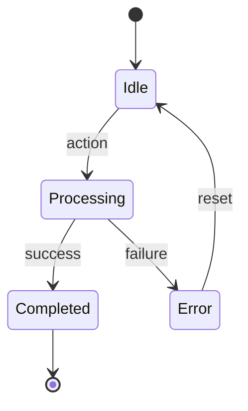

# Specification: {機能名}

## 0. Meta

| 項目 | 値 |
|------|-----|
| Source | {ソースコードパス} |
| Related | {関連ファイルパス} |
| Test Type | Unit / Integration / E2E |

## 1. Contract

> AI Instruction: この型定義を唯一の正解として扱い、モックやテストの型に使用すること。

```typescript
interface Input {
    // 入力の型定義
}

interface Output {
    // 出力の型定義
}
```

## 2. State (Mermaid)

> AI Instruction: この遷移図の全パス（Success/Failure/Edge）を網羅するテストを生成すること。



## 3. Logic (Decision Table)

> AI Instruction: 各行を test.each のパラメータとして Unit Test を生成すること。Runtime に応じたテストランナーを使用すること。

| Case ID | Input | Expected | Notes |
|---------|-------|----------|-------|
| UT-01 | ... | ... | 基本ケース |
| UT-02 | ... | ... | 境界値 |
| EX-01 | ... | Throw Error | 異常系 |

## 4. Side Effects (Integration)

> AI Instruction: 結合テストでは以下の副作用をスパイ/モックして検証すること。

| 種別 | 内容 |
|------|------|
| Network | {API呼び出し} |
| Store | {状態更新} |
| Navigation | {画面遷移} |

## 5. Notes

- {補足事項}
