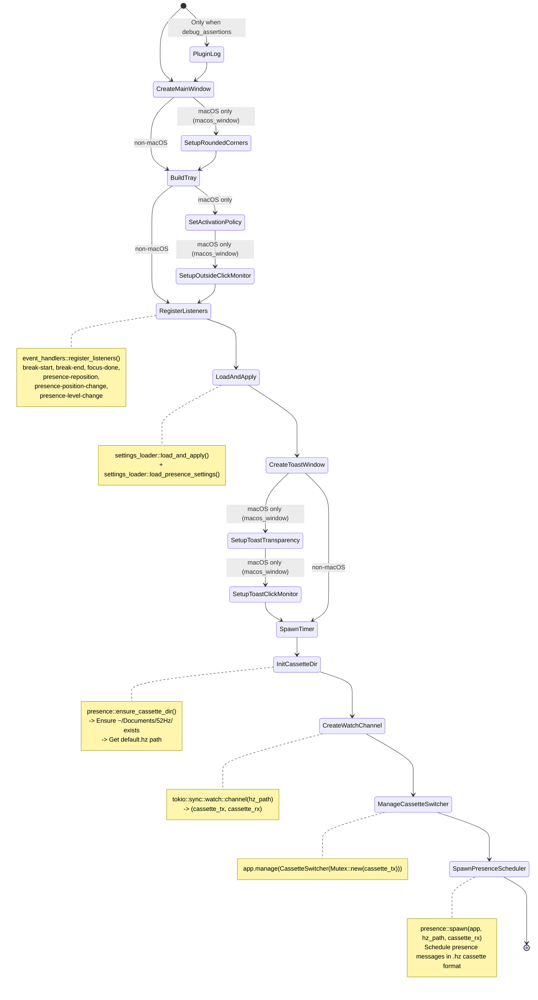
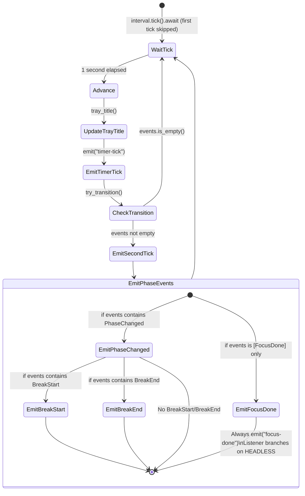
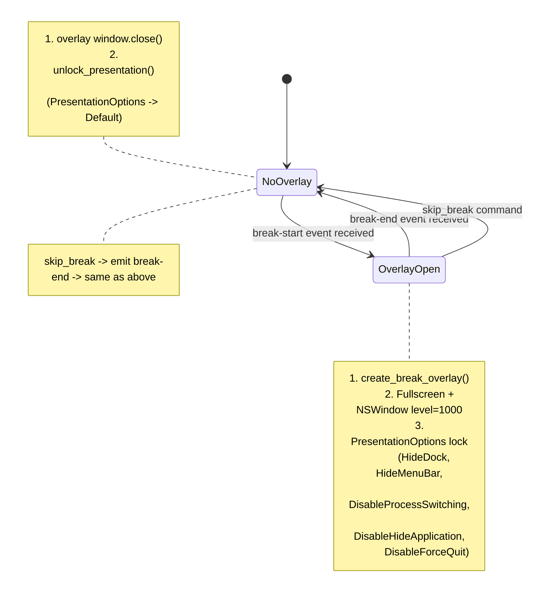
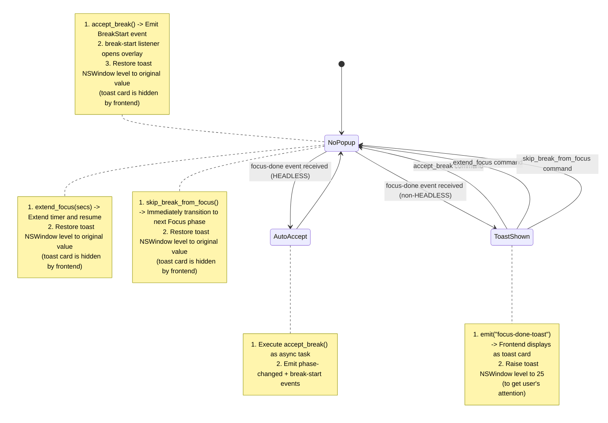

# Specification: Tauri Application Core (lib.rs)

## 0. Meta

| Source | Runtime |
|--------|---------|
| tauri/src/lib.rs | Rust |

| Item | Value |
|------|-------|
| Related | timer.rs, commands.rs, overlay.rs, tray.rs, media.rs, presence.rs, macos_window.rs, event_handlers.rs, settings_loader.rs |
| Test Type | Integration |

## 1. Contract (TypeScript)
> AI Instruction: Treat these type definitions as the single source of truth, and use them for mocks and test types.

```typescript
// --- Shared state types ---

type TimerPhase = "Focus" | "ShortBreak" | "LongBreak";

interface TimerSettings {
  focus_duration_secs: number;        // default: 1200 (20min)
  short_break_duration_secs: number;  // default: 60 (1min)
  long_break_duration_secs: number;   // default: 180 (3min)
  short_breaks_before_long: number;   // default: 3
}

interface TimerState {
  phase: TimerPhase;
  paused: boolean;
  elapsed_secs: number;
  phase_duration_secs: number;
  short_break_count: number;
  settings: TimerSettings;
}

type SharedTimerState = Arc<Mutex<TimerState>>;  // Rust side only

// --- Cassette-related types ---

interface CassetteInfo {
  path: string;       // Absolute path of .hz file
  title: string;      // Cassette title
}

// CassetteSwitcher: Tauri managed state (Rust side only)
// Mutex<watch::Sender<PathBuf>> — Watch channel sender for cassette switching

// --- Tauri commands (invokable from frontend) ---

declare function get_timer_state(): Promise<TimerState>;
declare function pause_timer(): Promise<void>;
declare function resume_timer(): Promise<void>;
declare function toggle_pause(): Promise<boolean>;    // returns: paused state
declare function skip_break(): Promise<void>;
declare function update_settings(settings: TimerSettings): Promise<void>;
declare function accept_break(): Promise<void>;
declare function extend_focus(secs: number): Promise<void>;
declare function skip_break_from_focus(): Promise<void>;
declare function open_break_overlay(): Promise<void>;
declare function close_break_overlay(): Promise<void>;
declare function reset_timer(): Promise<void>;
declare function get_today_sessions(): Promise<number>; // Today's completed session count
declare function list_cassettes(): Promise<CassetteInfo[]>;  // List of .hz files
declare function switch_cassette(path: string): Promise<void>; // Switch cassette
declare function open_cassette_folder(): Promise<void>;        // Open cassette folder in Finder
declare function quit_app(): Promise<void>;           // process::exit(0)

// --- Tauri events (listen/emit) ---

// Emitted every second with current TimerState
type TimerTickEvent = TimerState;

// Emitted on phase transition with new TimerState
type PhaseChangedEvent = TimerState;

// Emitted when break starts with current TimerState
type BreakStartEvent = TimerState;

// Emitted when break ends (payload is unit)
type BreakEndEvent = void;

// Emitted when focus phase completes, awaiting user choice (non-headless only)
type FocusDoneEvent = TimerState;

// Emitted to show focus-done as toast card (non-headless only)
type FocusDoneToastEvent = void;

// Emitted when toast window is clicked (global monitor, macOS)
type PresenceToastClickEvent = void;

// --- Presence Toast events (listen) ---

// Reposition toast window (fired on every toast add/remove)
type PresenceRepositionEvent = string;   // position string

// Reposition toast window (fired on position setting change)
type PresencePositionChangeEvent = string; // position string

// Change toast window level (fired on level setting change)
type PresenceLevelChangeEvent = string;    // level string

// --- Window definitions ---

interface MainWindow {
  label: "main";
  url: "index.html";
  size: { width: 320; height: 480 };
  visible: false;       // Initially hidden (shown on tray click)
  resizable: false;
  decorations: false;
  skipTaskbar: true;
  alwaysOnTop: true;
}

interface BreakOverlayWindow {
  label: "break-overlay";
  url: "index.html?view=break";
  decorations: false;
  skipTaskbar: true;
  closable: false;
  minimizable: false;
  maximizable: false;
  resizable: false;
  focused: true;
  backgroundColor: [10, 10, 14, 255];  // #0a0a0e
  // macOS: NSWindow level=1000, CanJoinAllSpaces | Stationary
}

interface FocusDonePopupWindow {
  label: "focus-done-popup";
  url: "index.html?view=focus-done";
  size: { width: 300; height: 200 };
  decorations: false;
  skipTaskbar: true;
  resizable: false;
  alwaysOnTop: true;
  focused: true;
  // Position: Top-right of monitor (calculated in logical coordinates)
  //   margin = 20.0 (logical pixels)
  //   x = max(0.0, lw - popupWidth - margin)
  //   y = max(margin, lh * 0.05)  // 5% from top edge (minimum margin)
  //   Fallback: (margin, margin) = (20, 20)
  // macOS: NSWindow level=25 (StatusWindowLevel), makeKeyAndOrderFront,
  //        activateIgnoringOtherApps (workaround for Accessory policy)
}

interface ToastWindow {
  label: "presence-toast";
  url: "index.html?view=toast";
  size: { width: 290; height: 80 };
  visible: false;       // hidden until a message arrives
  resizable: false;
  decorations: false;
  skipTaskbar: true;
  // Position: Calculated based on presence_position setting (margin=16, margin_top=40)
  // macOS: NSWindow level = based on presence_level ("always-front"=25, "dynamic"=0, "always-back"=-1), mouse-through, transparent
  //        WKWebView _setDrawsBackground:false (applied with 500ms delay)
  //        NSWindowCollectionBehavior: CanJoinAllSpaces | Stationary (1|16)
}

// --- Tray (direct NSStatusItem manipulation) ---
// Tauri TrayIconBuilder is NOT used (tray.rs creates NSStatusItem directly)
// id / tooltip properties do not exist
interface TrayImplementation {
  title: string;   // Output of tray_title(). Updated every second by update_tray_title()
  icon: "icons/tray-icon.png";  // 28.6x18.0pt, color, non-template
  // Left click: handle_tray_click() -> toggle main window visibility
}
```

## 2. State (Mermaid)
> AI Instruction: Generate tests that cover all paths (Success/Failure/Edge) of this transition diagram.

### 2.1 Application Lifecycle

```mermaid
stateDiagram-v2
    [*] --> Initializing : run()

    Initializing --> Running : setup() complete
    note right of Initializing
        1. Register plugins (positioner, notification, store, log)
        2. manage() SharedTimerState
        3. Register command handlers (including cassette commands)
        4. Execute setup() closure
           (CassetteSwitcher is also manage()'d)
    end note

    state Running {
        [*] --> MainWindowHidden
        MainWindowHidden --> MainWindowVisible : Tray left click
        MainWindowVisible --> MainWindowHidden : Focus lost / Tray left click
    }

    Running --> ExitPrevented : RunEvent::ExitRequested
    ExitPrevented --> Running : api.prevent_exit()
    Running --> [*] : quit_app() / process::exit(0)
```

### 2.2 setup() Internal Flow



### 2.3 Timer Loop (spawn_timer)



### 2.4 Break Overlay Lifecycle



### 2.5 FocusDone Popup Lifecycle



## 3. Logic (Decision Table)
> AI Instruction: Generate Unit Tests using each row as a test.each parameter.

### 3.1 run() Initialization Logic

| # | FIFTYTWOHZ_TEST_FAST_TIMER | Result: focus_duration | Result: short_break_duration | Result: long_break_duration | Result: short_breaks_before_long |
|---|------------------------|---------------------|---------------------------|--------------------------|-------------------------------|
| 1 | Not set | 1200 (20min) | 20 | 180 (3min) | 3 |
| 2 | Set | 5 | 3 | 5 | 2 |

### 3.2 setup() Loading Saved Settings

| # | FIFTYTWOHZ_TEST_FAST_TIMER | store("settings.json") | Saved keys present | Result |
|---|------------------------|---------------------|------------------|--------|
| 1a | Set | Ok(store) | Some present | Test settings applied at run() start, then also loaded from store and overwritten via apply_settings(). Store values ultimately take precedence |
| 1b | Set | Ok(store) | None present | Test settings from run() start are used as-is |
| 1c | Set | Err(_) | - | Test settings from run() start are used as-is |
| 2 | Not set | Ok(store) | Some present | Load from store -> Apply via apply_settings() |
| 3 | Not set | Ok(store) | None present | Default settings remain (apply_settings() not called) |
| 4 | Not set | Err(_) | - | Default settings remain (log output) |

**Store keys and unit conversion:**

| Store Key | Display Unit | TimerSettings Field | Conversion | Default Value |
|-----------|-------------|---------------------|------------|---------------|
| `focus_minutes` | Minutes | `focus_duration_secs` | x 60 | 1200 (20min) |
| `short_break_minutes` | Minutes | `short_break_duration_secs` | x 60 | 60 (1min) |
| `long_break_minutes` | Minutes | `long_break_duration_secs` | x 60 | 180 (3min) |
| `short_breaks_before_long` | Count | `short_breaks_before_long` | As-is | 3 |
| `pause_media_on_break` | boolean | - (Read directly on Rust side) | As-is | false |
| `presence_position` | string | - (Read directly on Rust side) | As-is | "top-right" |
| `presence_level` | string | - (Read directly on Rust side) | With migration | "dynamic" |

### 3.3 Toast Window Initial Position

| # | presence_position (store key) | x (logical coordinates) | y (logical coordinates) |
|---|------------------------------|------------------------|------------------------|
| 1 | "top-right" (default) | lw - toast_w - margin | margin_top |
| 2 | "top-left" | margin | margin_top |
| 3 | "bottom-right" | lw - toast_w - margin | lh - toast_h - margin |
| 4 | "bottom-left" | margin | lh - toast_h - margin |
| 5 | Monitor retrieval failure | margin | margin |

**Constants:** `toast_w=290, toast_h=80, margin=16, margin_top=40`

**presence_level store key:**

| # | presence_level | NSWindow level |
|---|---------------|---------------|
| 1 | "always-front" | 25 |
| 2 | "dynamic" (default) | 0 |
| 3 | "always-back" | -1 |
| 4 | "front" (legacy value -> migration) | 25 (converted to "always-front") |
| 5 | "back" (legacy value -> migration) | -1 (converted to "always-back") |

### 3.4 spawn_timer Loop: Event Emission Decision

| # | paused | elapsed < duration | events | tray update | timer-tick emitted | 2nd tick | phase-changed | break-start | break-end | focus-done |
|---|--------|-------------------|--------|------------|-------------------|----------|--------------|------------|----------|-----------|
| 1 | false | true (normal) | [] | yes | 1 time | no | no | no | no | no |
| 2 | false | false (transition) | [PhaseChanged, BreakStart] | yes | 2 times | yes | yes | yes | no | no |
| 3 | false | false (transition) | [PhaseChanged, BreakEnd] | yes | 2 times | yes | yes | no | yes | no |
| 4 | true | any | [] | yes | 1 time | no | no | no | no | no |
| 5 | false | false (transition) | [FocusDone] | yes | 2 times | yes | no | no | no | yes |
|   |       |              | * HEADLESS: listener auto-accepts -> emits phase-changed + break-start |||||||||
|   |       |              | * Non-HEADLESS: listener creates popup. Waits for user action |||||||||

### 3.5 break-start Listener: Overlay Creation + Media Pause

| # | FIFTYTWOHZ_HEADLESS | pause_media_on_break setting | Behavior |
|---|-----------------|------------------------|----------|
| 1 | Not set | false / not set | Execute create_break_overlay() on main thread |
| 2 | Not set | true | Call media::pause_media_apps() -> Save result to media_paused_apps -> Execute create_break_overlay() on main thread |
| 3 | Set | false / not set | Calls create_break_overlay(), but overlay internally detects HEADLESS and skips window creation (PresentationOptions lock is also not applied). No media control |
| 4 | Set | true | pause_media_apps() + save result -> Calls create_break_overlay(), but overlay internally skips window creation |

**Media pause decision flow (macOS only):**

```
1. Get "settings.json" via tauri_plugin_store::StoreExt
2. store.get("pause_media_on_break") -> Get bool (default: false)
3. If true:
   a. Call media::pause_media_apps() -> Get Vec<String>
   b. *media_paused_apps.lock().unwrap() = paused
```

**media_paused_apps type:** `Arc<std::sync::Mutex<Vec<String>>>`
- Uses `std::sync::Mutex` (listeners are synchronous closures so `.await` from `tokio::sync::Mutex` cannot be used)
- No deadlock concern since break-start and break-end are temporally exclusive

### 3.6 break-end Listener: Overlay Destruction + Media Resume

| # | FIFTYTWOHZ_HEADLESS | media_paused_apps | break-overlay window exists | Behavior |
|---|-----------------|-------------------|--------------------------|----------|
| 1 | Set | Non-empty | - | media::resume_media_apps(&apps) + clear media_paused_apps -> unlock_presentation() (no-op in HEADLESS since lock was never applied), return |
| 2 | Set | Empty | - | unlock_presentation() (no-op in HEADLESS since lock was never applied), return |
| 3 | Not set | Non-empty | Yes | media::resume_media_apps(&apps) + clear media_paused_apps -> window.close() + unlock_presentation() |
| 4 | Not set | Non-empty | No | media::resume_media_apps(&apps) + clear media_paused_apps -> unlock_presentation() only |
| 5 | Not set | Empty | Yes | window.close() + unlock_presentation() |
| 6 | Not set | Empty | No | unlock_presentation() only |

**Media resume decision flow (macOS only):**

```
1. std::mem::take(&mut *media_paused_apps.lock().unwrap()) to extract and clear Vec
2. Call media::resume_media_apps(&apps) only if Vec is non-empty
```

### 3.7 Main Window Visibility Toggle (Tray Left Click)

| # | Current visibility | Behavior |
|---|-------------------|----------|
| 1 | visible=true | window.hide() |
| 2 | visible=false | move_window(TrayBottomCenter) + show() + set_focus() + activateIgnoringOtherApps (macOS) |

### 3.8 ExitRequested Handling

| # | Event | Behavior |
|---|-------|----------|
| 1 | RunEvent::ExitRequested | api.prevent_exit() -- Block exit, maintain tray residence |
| 2 | quit_app command | process::exit(0) -- Force terminate |

## 4. Side Effects (Integration)
> AI Instruction: In integration tests, spy/mock and verify the following side effects.

### 4.1 Window Operations
| Side Effect | Trigger | Verification Method |
|------------|---------|-------------------|
| MainWindow creation (label="main") | setup() | Generated with WebviewWindowBuilder. visible=false, size=320x480 |
| MainWindow show/hide | Tray left click | Verify state change of `is_visible()` |
| MainWindow hide | Click outside window (NSEvent global monitor) | `NSEvent::addGlobalMonitorForEventsMatchingMask_handler` callback |
| BreakOverlay creation (label="break-overlay") | break-start event | `create_break_overlay()` invocation |
| BreakOverlay close | break-end event | `window.close()` invocation |
| FocusDone toast display | focus-done event (non-HEADLESS) | emit("focus-done-toast") -> Frontend displays toast card |
| ToastWindow creation (label="presence-toast") | setup() | Generated with WebviewWindowBuilder. visible=false, size=290x80, position=based on presence_position setting |
| ToastWindow reposition | presence-reposition / presence-position-change event | Recalculate logical coordinates via `set_position()` |
| ToastWindow level change | presence-level-change event | Change Z-order via `NSWindow::setLevel()` |

### 4.2 macOS Native API
> Note: The following NSWindow operations are delegated to the `macos_window.rs` module.

| Side Effect | Trigger | Verification Method |
|------------|---------|-------------------|
| ActivationPolicy::Accessory | setup() | Verify that no icon appears in the Dock |
| NSEvent::addGlobalMonitorForEventsMatchingMask_handler (LeftMouseDown) | setup() | Verify that clicking outside the window hides the main window. Callback created with block2::RcBlock, retained with std::mem::forget |
| NSWindow::setLevel(1000) | break-start | Overlay appears at topmost level |
| NSWindowCollectionBehavior (CanJoinAllSpaces, Stationary) | break-start | Verify display across all Spaces |
| PresentationOptions lock | break-start | HideDock, HideMenuBar, DisableProcessSwitching, DisableHideApplication, DisableForceQuit |
| PresentationOptions unlock | break-end | Revert to Default |
| media::pause_media_apps() | break-start (pause_media_on_break=true) | Verify that playing media apps are paused. Controls individual apps via AppleScript. Does not affect apps that are not running |
| media::resume_media_apps() | break-end (media_paused_apps is non-empty) | Verify that only paused apps resume playback |
| activateIgnoringOtherApps(true) | Tray left click (when showing popup) | Verify focus acquisition |
| NSWindow::setLevel(level) | Toast window creation | Based on presence_level setting ("always-front"=25, "dynamic"=0, "always-back"=-1) |
| NSWindow::setLevel(25) | focus-done event (non-HEADLESS) | Raise toast to foreground to get user's attention |
| NSWindow::setLevel(level) | accept_break / extend_focus / skip_break_from_focus | Restore toast level to original presence_level setting value |
| NSWindow::setOpaque(false) + setBackgroundColor(clearColor) + setHasShadow(false) | Toast window creation | Transparent window background |
| WKWebView _setDrawsBackground:false | 500ms after toast window creation | Recursively traverse view hierarchy and disable background drawing for all views |
| NSWindowCollectionBehavior (CanJoinAllSpaces\|Stationary = 1\|16) | Toast window creation | Display across all Spaces |
| NSEvent global monitor (LeftMouseDown) for toast click | setup() | Detect clicks within toast window area -> emit("presence-toast-click") |

### 4.3 Events (emit)
| Side Effect | Trigger | Payload |
|------------|---------|---------|
| emit("timer-tick") | Every second (spawn_timer) | TimerState |
| emit("timer-tick") | After phase transition (2nd time) | TimerState (post-transition) |
| emit("timer-tick") | toggle_pause | TimerState |
| emit("timer-tick") | update_settings | TimerState |
| emit("phase-changed") | Phase transition | TimerState |
| emit("break-start") | Focus -> Break transition | TimerState |
| emit("break-end") | Break -> Focus transition | () |
| emit("break-end") | skip_break command | () |
| emit("focus-done") | Focus complete (non-HEADLESS) | TimerState |
| emit("timer-tick") | focus-done listener (HEADLESS) — after accept_break() | TimerState (state after accept_break) |
| emit("focus-done-toast") | focus-done listener (non-HEADLESS) | () |
| emit("presence-toast-click") | NSEvent global monitor (click within toast window area) | () |

### 4.4 Tray Operations
| Side Effect | Trigger | Verification Method |
|------------|---------|-------------------|
| tray.set_title() | Every second (spawn_timer) | Matches output of tray_title() |
| tray::build_tray() -> NSStatusItem creation | setup() | Created via NSStatusBar.systemStatusBar(). icon=tray-icon.png (28.6x18.0pt), click handler=Hz52TrayHandler |

### 4.5 Plugins
| Plugin | Purpose |
|--------|---------|
| tauri_plugin_positioner | Plugin is registered, but window positioning is done via custom calculation in tray.rs's `position_window_below_tray()`. TrayBottomCenter is not used |
| tauri_plugin_notification | Notifications (future use) |
| tauri_plugin_store | Settings persistence. Loads saved settings in setup() before spawn_timer, saves via update_settings command |
| tauri_plugin_log | Log output in debug builds |
| tauri_plugin_autostart | Auto-start on macOS login. Registered with MacosLauncher::LaunchAgent. Controlled from frontend directly via JS API (`enable`/`disable`/`isEnabled`) |

### 4.6 Environment Variables
| Environment Variable | Effect |
|--------------------|--------|
| FIFTYTWOHZ_TEST_FAST_TIMER | Uses test fast timer settings (focus=5s, short=3s, long=5s, count=2) |
| FIFTYTWOHZ_HEADLESS | Skips window creation (for CI/testing). On break-start, create_break_overlay() is called but internally skips window creation (PresentationOptions lock is also not applied). On break-end, unlock_presentation() is a no-op. On focus-done, auto-accepts (skips popup creation) |

## 5. Notes

- `spawn_timer` is called from the `setup()` closure within `run()`. It is launched as a tokio async task and runs until application termination.
- The timer loop follows a 4-stage design: `advance() -> emit timer-tick -> try_transition() -> emit events`. This guarantees the order where the frontend observes `remaining=0` before the transition occurs.
- `ExitRequested` is blocked with `prevent_exit()` so the app stays resident in the tray even when all windows are closed. Termination only occurs via the `quit_app` command or the "Quit" tray menu option (`process::exit(0)`).
- The overlay window closes any existing instance before re-creating (prevents duplicate creation).
- macOS-specific implementations are wrapped in `#[cfg(target_os = "macos")]`, falling back to `set_fullscreen(true)` on non-macOS platforms.
- Test mode (`FIFTYTWOHZ_TEST_FAST_TIMER` + `FIFTYTWOHZ_HEADLESS`) allows integration tests to verify timer logic in fast cycles without windows.
- In setup(), `tauri_plugin_store` is used to load saved settings before `spawn_timer`. Store keys use frontend display units (minutes/seconds) and are converted to `TimerSettings` second units. When `FIFTYTWOHZ_TEST_FAST_TIMER` is set, the store is still read, but test settings have already been applied at the start of `run()`.
- lib.rs has been reduced to approximately 255 lines through module splitting. macOS NSWindow operations are delegated to `macos_window.rs`, event listener registration to `event_handlers.rs`, and store loading to `settings_loader.rs`. The public API (commands, events) remains unchanged.
- The Presence scheduler uses the `.hz` cassette format. Initialization in setup() follows this order: `ensure_cassette_dir()` -> get `default.hz` path -> create `watch::channel` -> register `CassetteSwitcher` as Tauri managed state -> `presence::spawn(app, hz_path, cassette_rx)`. Cassette switching is done through the `CassetteSwitcher` watch channel via the `switch_cassette` command.
