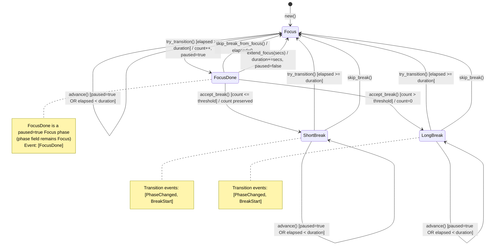

# Specification: Timer State Machine

## 0. Meta

| Source | Runtime |
|--------|---------|
| tauri/src/timer.rs | Rust |

| Item | Value |
|------|-------|
| Related | lib.rs (Tauri commands, event emit), frontend/lib/timer.ts |
| Test Type | Unit |

## 1. Contract (TypeScript)
> AI Instruction: Treat these type definitions as the single source of truth, and use them for mocks and test types.

```typescript
/** Timer phase */
type TimerPhase = "Focus" | "ShortBreak" | "LongBreak";

/** Events emitted on phase transition */
type PhaseEvent = "BreakStart" | "BreakEnd" | "PhaseChanged" | "FocusDone";

/** Timer settings */
interface TimerSettings {
  focus_duration_secs: number;       // u64, default: 1200 (20min)
  short_break_duration_secs: number; // u64, default: 60 (1min)
  long_break_duration_secs: number;  // u64, default: 180 (3min)
  short_breaks_before_long: number;  // u32, default: 3
}

/** Timer state (Serialize/Deserialize compatible, sent to frontend) */
interface TimerState {
  phase: TimerPhase;
  paused: boolean;
  elapsed_secs: number;         // u64
  phase_duration_secs: number;  // u64
  short_break_count: number;    // u32
  settings: TimerSettings;
}

/** Constructor */
function createTimerState(settings: TimerSettings): TimerState;

/** Remaining seconds (saturating_sub: never goes below 0) */
function remainingSecs(state: TimerState): number;

/** Remaining time display string "MM:SS" */
function remainingDisplay(state: TimerState): string;

/** Tray icon title: "MM:SS" | "MM:SS (break)" | "MM:SS (long break)" */
function trayTitle(state: TimerState): string;

/** Apply settings: immediately updates current phase duration, clamps elapsed if elapsed > duration */
function applySettings(state: TimerState, settings: TimerSettings): void;

/** Skip break: only effective during Break, returns to Focus */
function skipBreak(state: TimerState): PhaseEvent[];

/** Step 1: 1-second increment (no-op when paused) */
function advance(state: TimerState): void;

/** Step 2: Phase transition check + execution (empty if paused or elapsed < duration) */
function tryTransition(state: TimerState): PhaseEvent[];

/** FocusDone -> Break transition. Pre-condition: phase==Focus && paused==true */
function acceptBreak(state: TimerState): PhaseEvent[];

/** Extend focus. Pre-condition: phase==Focus && paused==true */
function extendFocus(state: TimerState, secs: number): void;

/** Skip break and start next Focus. Pre-condition: phase==Focus && paused==true */
function skipBreakFromFocus(state: TimerState): PhaseEvent[];

/** Reset timer: phase=Focus, paused=true, elapsed=0, phase_duration=focus_duration, short_break_count=0 */
function reset(state: TimerState): void;

/** #[cfg(test)] Raw tick without auto-accepting FocusDone */
function tickRaw(state: TimerState): PhaseEvent[];

/** #[cfg(test)] Convenience tick that auto-accepts FocusDone (for existing cycle tests) */
function tick(state: TimerState): PhaseEvent[];
```

## 2. State (Mermaid)
> AI Instruction: Generate tests that cover all paths (Success/Failure/Edge) of this transition diagram.



### Transition Condition Details

| Transition | Condition | Side Effects |
|-----------|-----------|-------------|
| Focus -> FocusDone | `elapsed >= duration` (try_transition) | count++, paused=true |
| FocusDone -> ShortBreak | `accept_break()` and `count <= threshold` | elapsed=0, duration=short_break_duration, paused=false |
| FocusDone -> LongBreak | `accept_break()` and `count > threshold` | count=0, elapsed=0, duration=long_break_duration, paused=false |
| FocusDone -> Focus (skip) | `skip_break_from_focus()` invocation | elapsed=0, duration=focus_duration, paused=false |
| FocusDone -> Focus (extend) | `extend_focus(secs)` invocation | duration+=secs, paused=false |
| ShortBreak -> Focus | `elapsed >= duration` | elapsed=0, duration=focus_duration |
| LongBreak -> Focus | `elapsed >= duration` | elapsed=0, duration=focus_duration |
| *Break -> Focus (skip) | `skip_break()` invocation | elapsed=0, duration=focus_duration, count preserved |

## 3. Logic (Decision Table)
> AI Instruction: Generate Unit Tests using each row as a test.each parameter.

### DT-01: advance()

| ID | paused | elapsed_before | expected_elapsed | note |
|----|--------|----------------|------------------|------|
| ADV-01 | false | 0 | 1 | Normal increment |
| ADV-02 | false | 99 | 100 | Works with large values |
| ADV-03 | true | 0 | 0 | No change when paused |
| ADV-04 | true | 50 | 50 | Frozen mid-way when paused |

### DT-02: try_transition()

| ID | phase | paused | elapsed | duration | threshold | count_before | expected_phase | expected_paused | expected_count | events | note |
|----|-------|--------|---------|----------|-----------|-------------|----------------|-----------------|----------------|--------|------|
| TT-01 | Focus | false | 3 | 3 | 2 | 0 | Focus | true | 1 | [FocusDone] | Focus complete: transitions to FocusDone (paused) |
| TT-02 | Focus | false | 2 | 3 | 2 | 0 | Focus | false | 0 | [] | elapsed < duration: no transition |
| TT-03 | Focus | true | 3 | 3 | 2 | 0 | Focus | true | 0 | [] | paused: no transition |
| TT-04 | Focus | false | 3 | 3 | 2 | 2 | Focus | true | 3 | [FocusDone] | count++, paused=true |
| TT-05 | Focus | false | 3 | 3 | 0 | 0 | Focus | true | 1 | [FocusDone] | threshold=0 still goes through FocusDone |
| TT-06 | ShortBreak | false | 1 | 1 | - | 1 | Focus | false | 1 | [PhaseChanged, BreakEnd] | Short -> Focus |
| TT-07 | LongBreak | false | 2 | 2 | - | 0 | Focus | false | 0 | [PhaseChanged, BreakEnd] | Long -> Focus |
| TT-08 | ShortBreak | false | 0 | 1 | - | 1 | ShortBreak | false | 1 | [] | elapsed < duration: no transition |
| TT-09 | Focus | false | 3 | 3 | 1 | 0 | Focus | true | 1 | [FocusDone] | count++, paused=true |
| TT-10 | Focus | false | 3 | 3 | 1 | 1 | Focus | true | 2 | [FocusDone] | count++, paused=true |

### DT-10: accept_break()

| ID | phase | paused | threshold | count_before | expected_phase | expected_count | expected_paused | events | note |
|----|-------|--------|-----------|-------------|----------------|----------------|-----------------|--------|------|
| AB-01 | Focus | true | 2 | 1 | ShortBreak | 1 | false | [PhaseChanged, BreakStart] | count <= threshold -> Short |
| AB-02 | Focus | true | 2 | 2 | ShortBreak | 2 | false | [PhaseChanged, BreakStart] | count == threshold -> Short |
| AB-03 | Focus | true | 2 | 3 | LongBreak | 0 | false | [PhaseChanged, BreakStart] | count > threshold -> Long, count=0 |
| AB-04 | Focus | true | 0 | 1 | LongBreak | 0 | false | [PhaseChanged, BreakStart] | threshold=0: count=1 > 0 -> Long |
| AB-05 | Focus | false | 2 | 1 | Focus | 1 | false | [] | paused=false: no-op |
| AB-06 | ShortBreak | true | 2 | 1 | ShortBreak | 1 | true | [] | phase!=Focus: no-op |

### DT-11: extend_focus()

| ID | phase | paused | duration_before | secs | expected_duration | expected_paused | note |
|----|-------|--------|-----------------|------|-------------------|-----------------|------|
| EF-01 | Focus | true | 1200 | 300 | 1500 | false | 5-minute extension |
| EF-02 | Focus | true | 1200 | 0 | 1200 | false | 0-second extension: duration unchanged, paused cleared |
| EF-03 | Focus | false | 1200 | 300 | 1200 | false | paused=false: no-op |
| EF-04 | ShortBreak | true | 20 | 60 | 20 | true | phase!=Focus: no-op |

### DT-12: skip_break_from_focus()

| ID | phase | paused | elapsed_before | expected_phase | expected_elapsed | expected_duration | expected_paused | events | note |
|----|-------|--------|----------------|----------------|------------------|-------------------|-----------------|--------|------|
| SF-01 | Focus | true | 1200 | Focus | 0 | focus_duration | false | [PhaseChanged] | Skip break from FocusDone |
| SF-02 | Focus | false | 0 | Focus | 0 | (unchanged) | false | [] | paused=false: no-op |
| SF-03 | ShortBreak | true | 0 | ShortBreak | 0 | (unchanged) | true | [] | phase!=Focus: no-op |

### DT-13: reset()

| ID | phase_before | paused_before | elapsed_before | short_break_count_before | expected_phase | expected_paused | expected_elapsed | expected_duration | expected_count | note |
|----|-------------|--------------|----------------|--------------------------|----------------|-----------------|------------------|-------------------|----------------|------|
| RE-01 | Focus | false | 500 | 0 | Focus | true | 0 | focus_duration_secs | 0 | Reset from mid-Focus |
| RE-02 | ShortBreak | false | 30 | 2 | Focus | true | 0 | focus_duration_secs | 0 | Reset from mid-ShortBreak |
| RE-03 | LongBreak | false | 60 | 0 | Focus | true | 0 | focus_duration_secs | 0 | Reset from mid-LongBreak |
| RE-04 | Focus | true | 0 | 0 | Focus | true | 0 | focus_duration_secs | 0 | Reset from initial state: no change |

### DT-03: apply_settings()

| ID | current_phase | elapsed | old_duration | new_focus | new_short | new_long | new_threshold | expected_duration | expected_elapsed | note |
|----|--------------|---------|-------------|-----------|-----------|----------|--------------|-------------------|------------------|------|
| AS-01 | Focus | 1 | 3 | 10 | 1 | 2 | 2 | 10 | 1 | Extension during Focus: duration updated, elapsed preserved |
| AS-02 | Focus | 50 | 100 | 30 | 1 | 2 | 2 | 30 | 30 | Shortening during Focus: elapsed clamped |
| AS-03 | Focus | 30 | 100 | 30 | 1 | 2 | 2 | 30 | 30 | elapsed == new_duration: exact match |
| AS-04 | Focus | 20 | 100 | 50 | 1 | 2 | 2 | 50 | 20 | elapsed < new_duration: preserved |
| AS-05 | ShortBreak | 0 | 1 | 999 | 1 | 2 | 2 | 1 | 0 | During Break: focus change does not affect duration |
| AS-06 | ShortBreak | 0 | 1 | 3 | 5 | 2 | 2 | 5 | 0 | During Break: short_break change is applied immediately |
| AS-07 | LongBreak | 0 | 2 | 3 | 1 | 10 | 2 | 10 | 0 | During Break: long_break change is applied immediately |

### DT-04: skip_break()

| ID | phase | elapsed | expected_phase | expected_elapsed | expected_duration | events | note |
|----|-------|---------|----------------|------------------|-------------------|--------|------|
| SK-01 | ShortBreak | 0 | Focus | 0 | focus_duration | [BreakEnd, PhaseChanged] | Skip ShortBreak |
| SK-02 | LongBreak | 1 | Focus | 0 | focus_duration | [BreakEnd, PhaseChanged] | Skip LongBreak (mid-way) |
| SK-03 | Focus | 1 | Focus | 1 | (unchanged) | [] | No-op during Focus |

### DT-05: remaining_secs()

| ID | elapsed | phase_duration | expected | note |
|----|---------|---------------|----------|------|
| RS-01 | 0 | 3 | 3 | Initial state |
| RS-02 | 1 | 3 | 2 | Mid-countdown |
| RS-03 | 3 | 3 | 0 | Exactly complete |
| RS-04 | 100 | 3 | 0 | saturating_sub: never negative |

### DT-06: remaining_display()

| ID | remaining_secs | expected | note |
|----|---------------|----------|------|
| RD-01 | 1200 | "20:00" | 20 minutes |
| RD-02 | 1140 | "19:00" | 19 minutes |
| RD-03 | 5 | "00:05" | 5 seconds |
| RD-04 | 0 | "00:00" | Zero |
| RD-05 | 1 | "00:01" | 1 second |
| RD-06 | 60 | "01:00" | Minute boundary |

### DT-07: tray_title()

| ID | phase | remaining_display | expected | note |
|----|-------|------------------|----------|------|
| TR-01 | Focus | "00:03" | "00:03" | No label |
| TR-02 | ShortBreak | "00:01" | "00:01 (break)" | Break label |
| TR-03 | LongBreak | "00:02" | "00:02 (long break)" | Long break label |

### DT-08: TimerSettings::default()

| ID | field | expected | note |
|----|-------|----------|------|
| DF-01 | focus_duration_secs | 1200 | 20 minutes |
| DF-02 | short_break_duration_secs | 60 | 60 seconds (1 minute) |
| DF-03 | long_break_duration_secs | 180 | 3 minutes |
| DF-04 | short_breaks_before_long | 3 | 3 times |

### DT-09: Full Cycle Sequence (short_breaks_before_long=2, focus=3, short=1, long=2)

| ID | tick_range | phase | duration | short_break_count | note |
|----|-----------|-------|----------|-------------------|------|
| CY-01 | 0 (initial) | Focus | 3 | 0 | Initial state |
| CY-02 | 1-3 | Focus -> ShortBreak | 1 | 1 | First Short |
| CY-03 | 4 | ShortBreak -> Focus | 3 | 1 | Return to Focus |
| CY-04 | 5-7 | Focus -> ShortBreak | 1 | 2 | Second Short |
| CY-05 | 8 | ShortBreak -> Focus | 3 | 2 | Return to Focus |
| CY-06 | 9-11 | Focus -> LongBreak | 2 | 0 | count=3 > threshold=2 -> Long, reset |
| CY-07 | 12-13 | LongBreak -> Focus | 3 | 0 | Return to Focus, cycle complete |

## 4. Side Effects (Integration)
> AI Instruction: In integration tests, spy/mock and verify the following side effects.

### SE-01: timer-tick Event

| Trigger | Event Name | Payload | Verification Method |
|---------|----------|---------|-------------------|
| Every-second timer loop | `timer-tick` | `TimerState` (JSON serialize) | lib.rs timer loop emits after advance() but before try_transition(), so the frontend can observe remaining=0 |

### SE-02: focus-done Event

| Trigger | Event Name | Payload | Verification Method |
|---------|----------|---------|-------------------|
| When try_transition() returns PhaseEvent::FocusDone | `focus-done` | None (handled on lib.rs side) | lib.rs notifies the frontend and prompts the user to choose break accept/extend/skip |

### SE-03: break-start Event

| Trigger | Event Name | Payload | Verification Method |
|---------|----------|---------|-------------------|
| When try_transition() returns PhaseEvent::BreakStart | `break-start` | None (handled on lib.rs side) | lib.rs displays the overlay window |

### SE-04: break-end Event

| Trigger | Event Name | Payload | Verification Method |
|---------|----------|---------|-------------------|
| When try_transition() returns PhaseEvent::BreakEnd | `break-end` | None (handled on lib.rs side) | lib.rs hides the overlay window |

### SE-05: skip_break Command

| Trigger | Side Effect | Verification Method |
|---------|------------|-------------------|
| User invokes the skip_break Tauri command | TimerState.skip_break() -> BreakEnd event -> overlay hidden | lib.rs skip_break command handler |

### SE-06: update_settings Command

| Trigger | Side Effect | Verification Method |
|---------|------------|-------------------|
| User changes settings | TimerState.apply_settings() -> immediately updates current phase duration | lib.rs update_settings command handler |

### SE-07: Serialization (Frontend Integration)

| Target | Format | Verification Method |
|--------|--------|-------------------|
| TimerState | JSON (serde) | `serde_json::to_string` / `serde_json::from_str` round-trip |
| TimerSettings | JSON (serde) | Same as above |
| TimerPhase | JSON (serde) | `"Focus"` / `"ShortBreak"` / `"LongBreak"` strings |

## 5. Notes

### Key Design Decisions

1. **Separation of advance() and try_transition()**: By emitting timer-tick between advance() and try_transition(), the frontend can observe the remaining=0 state. This enables the natural countdown display of 3, 2, 1, 0.

2. **Exact timing via `<` comparison**: Using `elapsed < duration` for comparison, phases complete at exactly `duration` ticks (no off-by-one). Example: focus_duration_secs=5 transitions at exactly 5 ticks.

3. **Immediate application of apply_settings()**: Setting changes also update the current phase's duration. If elapsed > new_duration, elapsed is clamped (not reset), and transition occurs on the next tick.

4. **`>` comparison for short_break_count**: LongBreak is determined by `count > threshold`. With threshold=N, LongBreak occurs after N ShortBreaks. With threshold=0, ShortBreak is skipped and LongBreak always occurs.

5. **skip_break() preserves count**: Even after skipping, short_break_count is not reset, so cycle progression is correctly maintained after a skip.

6. **FocusDone is an intermediate state**: When Focus completes, try_transition() does not immediately transition to Break; instead it returns FocusDone with paused=true. It waits for the user to choose accept_break() / extend_focus() / skip_break_from_focus().

7. **tick() and tick_raw() are test-only**: Both are restricted to `#[cfg(test)]`. `tick()` auto-accepts FocusDone so existing cycle tests need no changes (convenience method). `tick_raw()` does not auto-accept FocusDone, used for tests that directly observe FocusDone events. In production, advance() and try_transition() are called separately.

8. **BreakEnd / PhaseChanged emission order**: Break completion via `try_transition()` emits `[PhaseChanged, BreakEnd]`, while skip via `skip_break()` emits `[BreakEnd, PhaseChanged]`. This is intentional; the frontend determines overlay hiding upon arrival of either event and does not depend on order.

### Frontend Settings Value Mapping

| Frontend (store) | Backend (TimerSettings) | Conversion |
|-----------------|------------------------|------------|
| focusMinutes | focus_duration_secs | * 60 |
| shortBreakMinutes | short_break_duration_secs | * 60 |
| longBreakMinutes | long_break_duration_secs | * 60 |
| shortBreaksBeforeLong | short_breaks_before_long | As-is |
